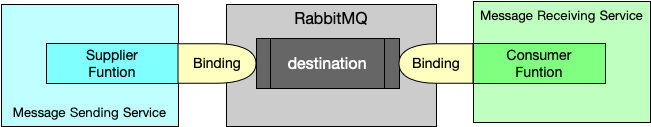

# Spring cloud stream demo 

This is a rewritten version of the demo for [_Event Driven Microservices with Spring Cloud Stream_](https://spring.io/blog/2019/10/15/simple-event-driven-microservices-with-spring-cloud-stream) which uses deprecated APIs, including `@EnableBinding` `@Input` and `@Output`.

The system has two spring boot applications as well as a RabbitMQ service.

Instead of working with annotation-based configuration, spring now uses detected beans of `Consumer`/`Function`/`Supplier` to define your streams for you. Spring cloud stream builds necessary exchanges/bindings/queues for your application in MOM automatically with the abstraction of binders.

Please pay attention in the `application.yml` file in each module, where such binders/bindings are configured. 

### Run

1. Start a RabbitMQ. You can use the `start-server.sh` script.
2. Open http://localhost:15672 in your browser and login with guest:guest into RabbitMQ management page.
3. Start loan source application. You should see an exchange named `output` which has one incoming message per second.
4. Start load check application. You should see APPROVED and REJECTED logs in the console. Two additional exchanges are created. You should notice the combined message rate of these two exchanges equals 1 per second. Figure why.